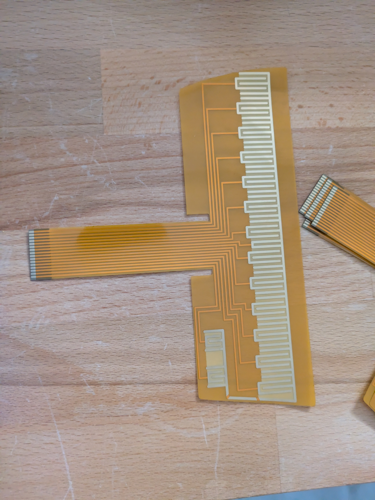

# Omnichord Strumplate Reproduction

## 🎥 Demo Video

This project is an effort to reproduce the strumplate for the Suzuki Omnichord. It started with the OM-84 because that's what we had on hand, and now also covers the OM-27.

### Repo Structure

- `om84_strumplate/` — OM-84 work (flex PCB design, gerbers, references)
- `om27_strumplate/` — OM-27 work (in progress)

### Background

The Omnichord strumplate is a large capacitive touch sensor that lets you strum chords. Over time these plates commonly fail — the conductive surface wears out, traces crack, or sections stop responding.

Because the original strumplate is a glued multi-layer assembly, repairing or replacing it is extremely difficult. Original parts are long discontinued, and good donor units are hard to find.

### Project Goal

We're working on modern reproductions that can be used to restore broken units, starting with the OM-84 and OM-27.

A [brave technician](https://www.reddit.com/user/adamjsp/) is working to restore his own strumplate and generously shared high-quality scans. Those references are the main reason this project exists — we're now using them to design new, buildable versions.

### Current Status

Early stage. The goal is to create drop-in replacements that match the original feel and response as closely as possible.

**OM-84** (see `om84_strumplate/`)

UPDATE (JUNE 25, 2026)
Version 1.0 of the flex PCB works very well, may be a bit thin at 0.11mm, but certainly works. GERBERS updated, should come back from JLCPCB with no issue during review.

**OM-27** (see `om27_strumplate/`)

Just getting started — early files only, nothing tested yet.

### 3D Printable Parts

There are now SCAD and STL files in progress for both models. The curves aren't quite right yet, so treat these as a starting point rather than final, print-ready parts.

### How to Help

- Getting the SCAD/STL curves dialed in for an accurate fit
- Measurements and dimensions of other models (e.g. OM-36)
- High-res photos of working and failed strumplates, all models

### To-Do
- Tighten up gold teeth pitch, insertion errors sometimes?
- Perfect bottom curves of plates in SCAD
- Build guide, compare conductive layer materials

Feel free to open issues or pull requests if you want to contribute.

---

Any feedback or suggestions on the README itself is also welcome.
